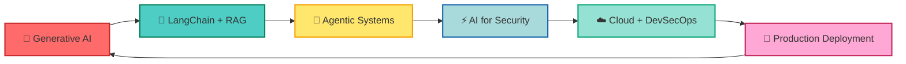

<div align="center">

# 👋 Hi, I'm Tushar Singh Chauhan

### 🚀 Full-Stack Developer | 🤖 AI Engineer | 🔐 Cybersecurity Enthusiast


</div>

<div align="center">
  
  
  
</div>

<br/>

---

## 🎯 About Me

```typescript
    Education: "B.Tech Computer Science @ PSIT Kanpur (2021-2025)",
    Location: "Lucknow, Uttar Pradesh, India 🇮🇳",
    Passions: ["Full-Stack Development", "Generative AI", "Cybersecurity"],
    CurrentFocus: "Building AI-driven security tools",
    Philosophy: "Where creativity meets code and security meets intelligence",
    FunFact: "I led a CTF team and played college-level basketball! 🏀"
```

🎓 **B.Tech Computer Science** student with a passion for building intelligent, secure applications  
🔐 Certified in **SOC Analysis**, **Digital Forensics**, and **Generative AI**  
💡 Creating AI-driven solutions that solve real-world challenges  
🌟 Open to collaboration on innovative projects

---

## 💻 Tech Arsenal

<div align="center">

### Languages & Frameworks


### Frontend Development


### Backend Development


### AI & Machine Learning


### Databases & Cloud


### Tools & Technologies


</div>

---

## 🎯 Expertise Areas

<div align="center">

| 🤖 **Generative AI** | 🌐 **Full-Stack** | 🔐 **Cybersecurity** | ☁️ **Cloud & DevOps** |
|:---:|:---:|:---:|:---:|
| LangChain & RAG | MERN Stack | SOC Analysis | Oracle Cloud |
| Prompt Engineering | FastAPI | Threat Intelligence | Docker & K8s |
| Llama 3 & OpenAI | RESTful APIs | Digital Forensics | CI/CD Pipelines |
| Agentic Systems | Database Design | Penetration Testing | Cloud Deployment |

</div>

---

## 🚀 Featured Projects

<div align="center">

### 🤖 CyberAI - AI-Powered Cybersecurity Assistant

[](https://github.com/Tusharsinghchauh/Cyber-AI)

**An intelligent cybersecurity companion that integrates 20+ security tools**

- 🎯 Delivers command syntax and smart recommendations
- 🧠 Built with LangChain and OpenAI API
- ⚡ React + Node.js + Express architecture

`React` `Node.js` `Express` `LangChain` `OpenAI API`

---

### 🧬 CogniChat - Chat with Your PDFs Securely

[]((https://github.com/Tusharsinghchauh/CogniChat))

**Local RAG-based chatbot for private document analysis**

- 🔒 100% Private - All processing happens locally
- 📚 Powered by Llama 3 for intelligent responses
- 💾 ChromaDB for efficient vector storage

`React` `FastAPI` `LangChain` `ChromaDB` `Llama 3`

---

### 🏥 Health Harbor - AI Healthcare Finder

[](https://github.com/Tusharsinghchauh)

**Intelligent hospital finder based on medical conditions**

- 🤖 Google Gemini AI for smart recommendations
- 🗺️ Location-based hospital search
- 💊 Condition-specific facility matching

`MongoDB` `Express` `React` `Node.js` `Gemini API`

</div>

---

## 🏆 Certifications & Achievements

<div align="center">

| 🎓 Certification | 🏢 Organization | 📅 Year |
|:---|:---:|:---:|
| 🧠 **Oracle Cloud Infrastructure 2025 Certified Generative AI Professional** | Oracle | 2025 |
| 🛡️ **SOC Level 1** | TryHackMe | 2024 |
| 🔍 **Digital Forensics Essentials (DFE)** | EC-Council | 2024 |
| 💥 **Penetration Testing & Ethical Hacking** | Cybrary | 2024 |
| ✨ **Prompt Design in Vertex AI** | Google Cloud | 2024 |

</div>

### 🏅 Leadership & Extracurriculars

- 🕵️ **CTF Team Lead** - Led a team of 5 in Cybersecurity Capture The Flag Competition
- 🏀 **Basketball Team Captain** - Secured 2nd place in College Tournament
- 🏸 **Regional Badminton Player** - Represented school at regional competitions

---

## 📊 GitHub Statistics

<div align="center">


</div>

<div align="center">


</div>

<div align="center">


</div>

---

## 🎯 Current Focus & Learning Path



### 📈 What I'm Working On

- 🔒 Building advanced AI-powered cybersecurity tools
- ⚙️ Exploring Agentic AI frameworks and multi-agent systems
- ☁️ Learning Cloud AI Deployment with Oracle and AWS
- 📊 Enhancing AI workflow automation and optimization
- 🔐 Contributing to open-source security projects

---

## 🤝 Let's Connect!

<div align="center">

[](https://linkedin.com/in/tushar-singh-chauhan)
[](https://github.com/Tusharsinghchauh)
[](https://twitter.com/tusharsinghchauhan)
[](https://yourportfolio.com)
[](mailto:tushar@example.com)
[](https://leetcode.com/tusharsinghchauh)
[](https://hackerrank.com/tusharsinghchauh)

</div>

---

## 💭 Developer Wisdom

<div align="center">


</div>

---

<div align="center">

### 🌟 Thanks for visiting my profile! 🌟

**"The best way to predict the future is to create it."** – Peter Drucker


<sub>Made with ❤️ and ☕ by Tushar Singh Chauhan</sub>

</div>
